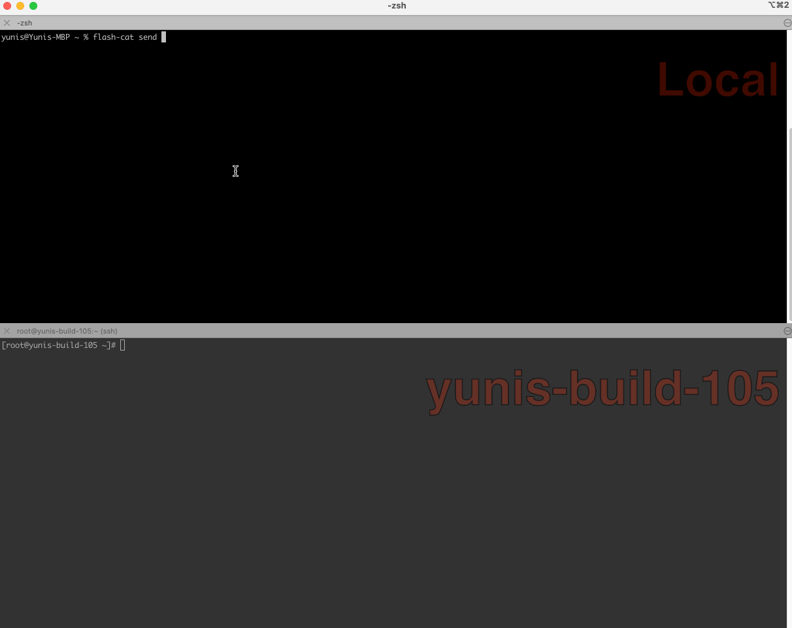

# Flash-Cat

Securely send the file folder from one computer to another computer.

- **symmetric encryption** (using aes-gcm)
- allows **multiple file** transfers
- easy **cross-platform** transfers (Windows, Linux, Mac)



## Install

### Download for your system
```bash
https://github.com/yunis-du/flash-cat/releases
```

### On macOS you can install the latest release with Homebrew
```bash
brew tap yunis-du/brew
brew install flash-cat
```

## Usage

### simple send and receive
send:
```bash
flash-cat send files or folder

...
Share code is: xx-xxxx-xxxx
...
```
receive:
```bash
flash-cat recv xx-xxxx-xxxx
```

## Deployment your owner relay