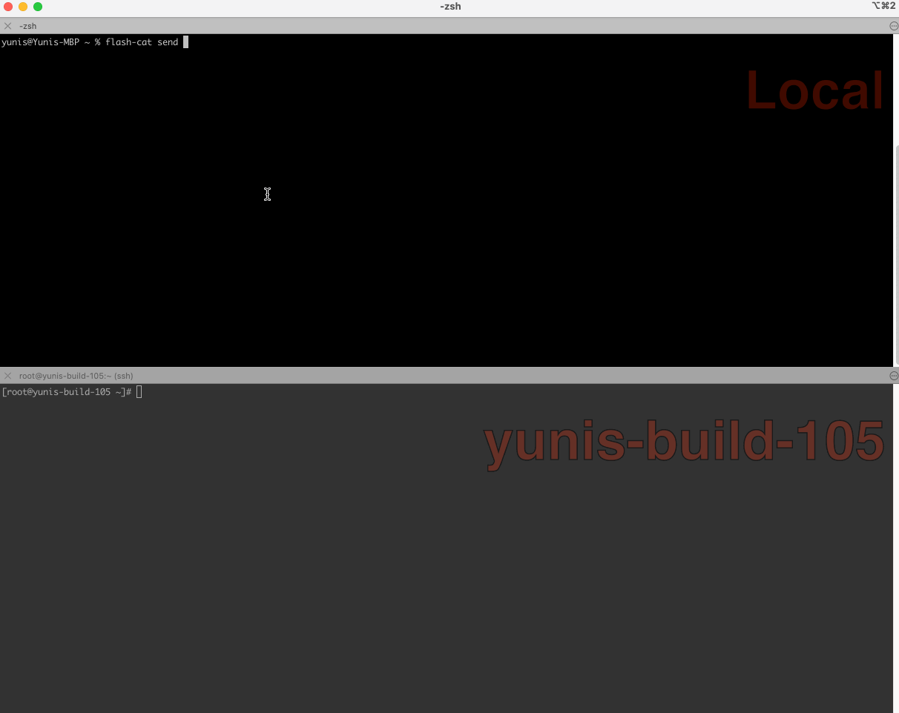

# Flash-Cat

安全地在两台计算机之间传输文件和文件夹。

- **对称加密** (使用 aes-gcm)
- 支持**多文件**传输
- 简单的**跨平台**传输 (Windows, Linux, Mac)



## 安装

### 自动安装脚本

#### Linux/macOS
```bash
curl -fsSL https://raw.githubusercontent.com/yunis-du/flash-cat/master/install.sh | sudo bash
```
##### 中国大陆
```bash
curl -fsSL https://download.yunisdu.com/flash-cat/install_cn.sh | sudo bash
```

#### Windows(以管理员身份运行Powershell)
```powershell
irm https://raw.githubusercontent.com/yunis-du/flash-cat/master/install.ps1 | iex
```
##### 中国大陆
```powershell
irm https://download.yunisdu.com/flash-cat/install_cn.ps1 | iex
```

### 使用 yum 安装
yum包管理器系统，如Fedora、RockyLinux等。目前，只支持amd64和arm64架构

```bash
sudo curl -o /etc/yum.repos.d/flash-cat.repo http://repo.yunisdu.com/rpm/flash-cat/flash-cat.repo && sudo yum install flash-cat -y
```

### 使用 apt-get 安装
基于apt包管理器的系统（如Debian、Ubuntu及其衍生产品）。

```bash
echo "deb [trusted=yes] http://repo.yunisdu.com/apt/ flash-cat main" | sudo tee /etc/apt/sources.list.d/flash-cat.list && sudo apt-get update && sudo apt-get install flash-cat
```

### 在macOS上，可以通过Homebrew安装最新版本
对于macOS，使用Homebrew软件包管理器安装最新版本的flash-cat。

```bash
brew tap yunis-du/brew
brew install flash-cat
```

### 或者，您可以安装Cargo并从源代码构建（需要Cargo 1.85+）

```bash
cargo install --git https://github.com/yunis-du/flash-cat flash_cat_cli
```

## 用法

### 简单的发送与接收
发送:
```bash
flash-cat send files or folder

...
Share code is: xx-xxxx-xxxx
...
```
接收:
```bash
flash-cat recv xx-xxxx-xxxx
```

## 部署你自己的终极服务

您可以部署自己的中继服务器来处理本地网络或互联网上的文件传输。

### 启动中继服务
```bash
flash-cat relay
```
